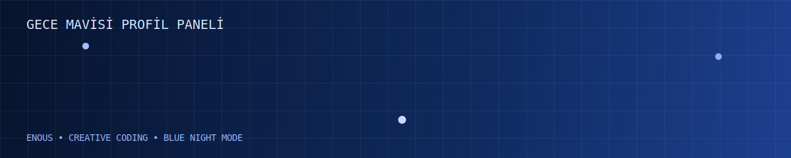
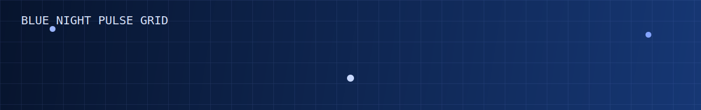
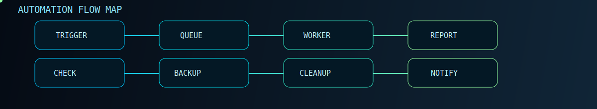

<div align="center">
  
</div>

<div align="center">
  
</div>

<div align="center">
  
</div>

<p align="center">
  
  
  
</p>

## Hakkımda
- Temiz mimari, güçlü performans ve sürdürülebilir kod odaklı çalışıyorum.
- Web, yazılım ve ürün deneyimi tarafında modern projeler geliştiriyorum.
- Yeni teknolojileri düzenli olarak öğrenip projelerime uyguluyorum.

## Canlı Animasyon Paneli
<div align="center">
  
  
</div>

## Öne Çıkan Proje
<div align="center">
  <a href="https://github.com/Enous/pulsepilot-automation-studio">
    
  </a>
</div>

```bash
git clone https://github.com/Enous/pulsepilot-automation-studio.git
cd pulsepilot-automation-studio
python main.py --config configs/sample.plan.json --once
```

## Teknoloji Yığını
<p>
  
</p>

## GitHub İstatistikleri
<div align="center">
  
  
</div>

<div align="center">
  
</div>

<div align="center">
  
</div>

## Aktivite Grafiği
<div align="center">
  
</div>

## Katkı Yılanı
<div align="center">
  <picture>
    <source media="(prefers-color-scheme: dark)" srcset="https://raw.githubusercontent.com/Enous/Enous/output/github-contribution-grid-snake-dark.svg" />
    <source media="(prefers-color-scheme: light)" srcset="https://raw.githubusercontent.com/Enous/Enous/output/github-contribution-grid-snake.svg" />
    
  </picture>
</div>

<div align="center">
  
</div>
