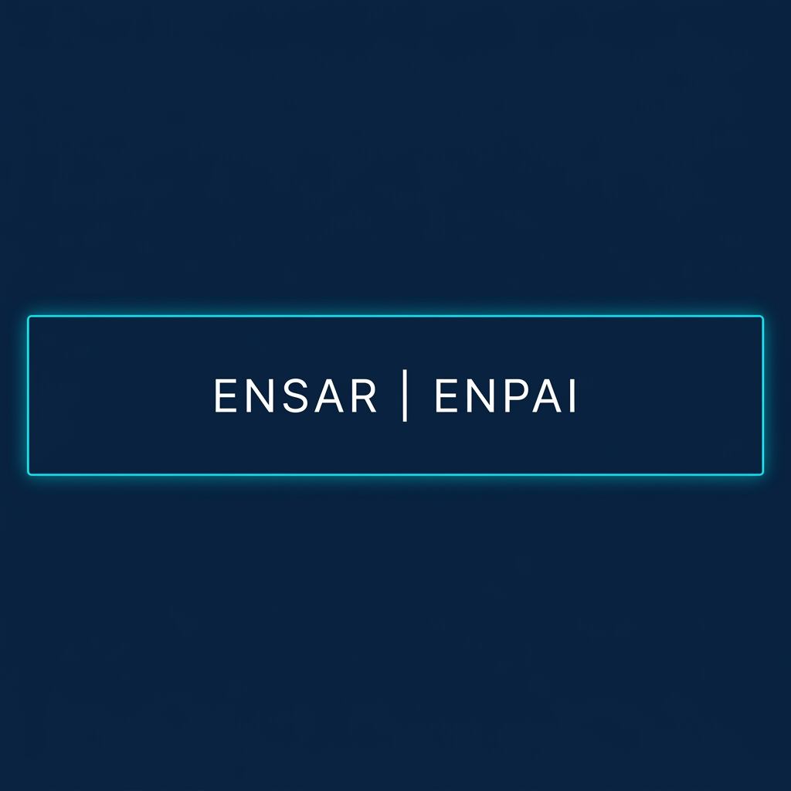

  

  

  
  

---

### 🌙 Hakkımda
Ben **Ensar**, **Enpai**'nin kurucusu ve tutkulu bir yazılım geliştiriciyim. Karmaşık sistemleri, temiz kod ve büyüleyici tasarımlarla (Night Blue estetiği 🌌) basitleştirmeye odaklanıyorum.

- 💎 **Enpai** markasıyla kullanıcı deneyimini önceliklendiren araçlar geliştiriyorum.
- ⚡ Performans ve minimalist tasarım kırmızı çizgim.
- 🛠️ Her gün daha ferah ve sürdürülebilir bir kod dünyası için çalışıyorum.

---

### 🚀 Öne Çıkan Projeler

  

  

---

### 📊 İstatistik ve Ritm

  
  

  

---

### 🛠️ Teknoloji Yığını

  

---

### 🐍 Katkı Yılanı

  <picture>
    <source media="(prefers-color-scheme: dark)" srcset="https://raw.githubusercontent.com/Enous/Enous/output/github-contribution-grid-snake-dark.svg" />
    
  </picture>

  

