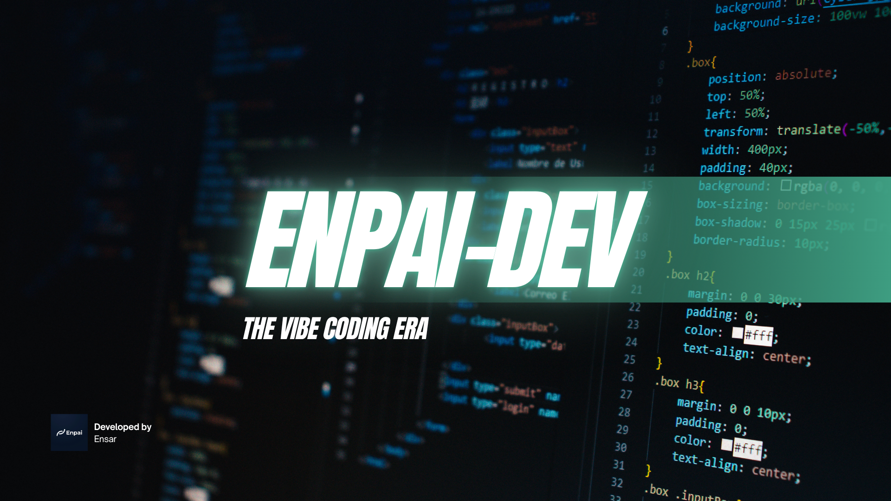
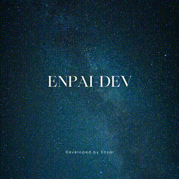

  

 

  

 

<table width="100%" align="center" style="border-collapse: collapse; border: none;">
  <tr>
    <td width="50%" valign="top">
      <h3>👨‍💻 Ben Kimim?</h3>
      <blockquote>
        Selam, ben Ensar. Vibe coding tarzında takılan ve kendi çapında bir şeyler üretmeyi seven bir lise öğrencisiyim. Kendi halimde kod yazıp, günlük işlerimi kolaylaştıracak ufak araçlar yapmaktan keyif alıyorum.
          
        Şu sıralar siber güvenlik alanına da merak sardım, o tarafta da kendimi geliştirmeye çalışıyorum.
      </blockquote>
    </td>
    <td width="50%" valign="top">
      <h3>⚡ Nelerle Uğraşıyorum?</h3>
      <ul>
        <li>🌐 <b>Web Geliştirme:</b> HTML, CSS, JavaScript ve özellikle <b>React</b> ile dinamik arayüzler.</li>
        <li>🖥️ <b>Masaüstü:</b> <b>Python (PyQt6)</b> ve <b>Electron.js</b> ile cross-platform araçlar.</li>
        <li>⚙️ <b>Backend & Scripting:</b> PHP ve <b>Bun (TypeScript)</b> ile modern arka uç süreçleri.</li>
        <li>🗄️ <b>Veritabanı & API:</b> Veritabanı yönetimi ve dış API entegrasyonları.</li>
        <li>🛡️ <b>Siber Güvenlik:</b> Temel sızma testleri ve analizlere olan ilgim devam ediyor.</li>
      </ul>
    </td>
  </tr>
</table>

 

### 📂 Öne Çıkan Projem

<table width="600" align="center" style="border-collapse: collapse; border: none;">
  <tr>
    <td align="center">
      
       
      <blockquote align="left">
        <b>Enpai Dev</b>, masaüstündeki veya indirilenler klasöründeki dağınık dosyaları saniyeler içinde toparlayan kendi yaptığım bir dosya düzenleyici. Node.js ve Electron.js kullanarak geliştirdim.
          
        ✅ Dosyaları türüne göre (kod, medya, oyun vb.) otomatik klasörler. 
        ✅ Seçtiğiniz hedefe taşıma veya kopyalama yapabilir. 
        ✅ Binlerce dosyayı aynı anda donmadan işleyebilir.
      </blockquote>
    </td>
  </tr>
</table>

 

### 📊 İstatistikler

  <table border="0">
    <tr>
      <td width="50%">
        
      </td>
      <td width="50%">
        
      </td>
    </tr>
  </table>
  

 

### 🛠️ Kullandığım Teknolojiler

  

 

  

 

  <i>🌌 stay curious, keep coding.</i>

